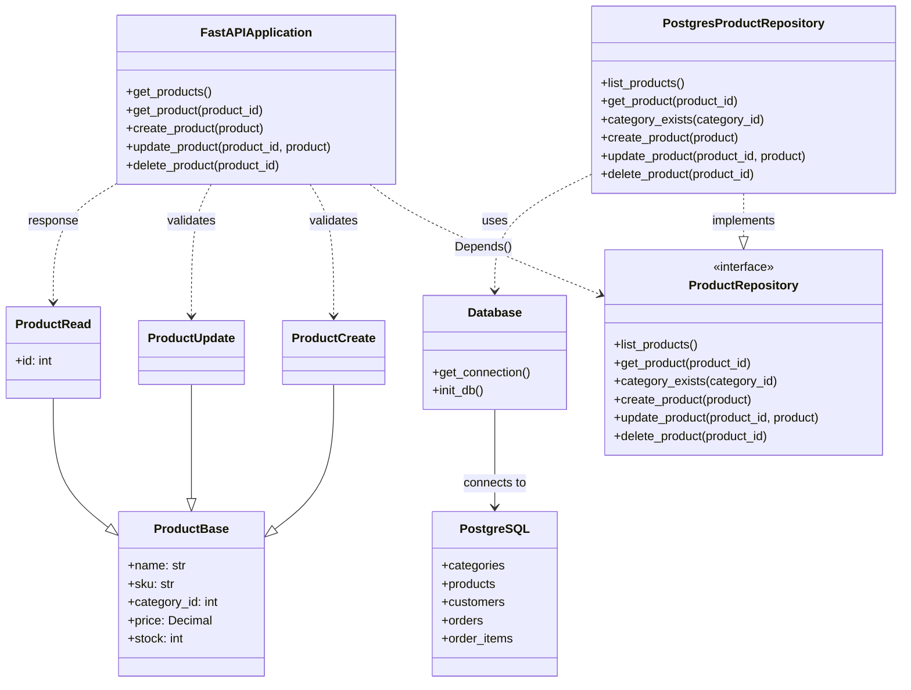

# C4 Code Diagram — Shop Management API

```mermaid
classDiagram
    direction TB

    class FastAPIApplication {
        +get_products()
        +get_product(product_id)
        +create_product(product)
        +update_product(product_id, product)
        +delete_product(product_id)
    }

    class ProductRepository {
        <<interface>>
        +list_products()
        +get_product(product_id)
        +category_exists(category_id)
        +create_product(product)
        +update_product(product_id, product)
        +delete_product(product_id)
    }

    class PostgresProductRepository {
        +list_products()
        +get_product(product_id)
        +category_exists(category_id)
        +create_product(product)
        +update_product(product_id, product)
        +delete_product(product_id)
    }

    class ProductBase {
        +name: str
        +sku: str
        +category_id: int
        +price: Decimal
        +stock: int
    }

    class ProductCreate
    class ProductUpdate
    class ProductRead {
        +id: int
    }

    class Database {
        +get_connection()
        +init_db()
    }

    class PostgreSQL {
        +categories
        +products
        +customers
        +orders
        +order_items
    }

    PostgresProductRepository ..|> ProductRepository : implements

    FastAPIApplication ..> ProductRepository : Depends()
    FastAPIApplication ..> ProductCreate : validates
    FastAPIApplication ..> ProductUpdate : validates
    FastAPIApplication ..> ProductRead : response

    ProductCreate --|> ProductBase
    ProductUpdate --|> ProductBase
    ProductRead --|> ProductBase

    PostgresProductRepository ..> Database : uses
    Database --> PostgreSQL : connects to
```

